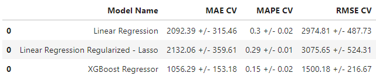

# Rossmann Sales Prediction

## Previsão de Vendas de uma Rede de Drogarias

## 1.0 Questão de Negócio

A Rossmann é uma rede internacional de drogarias que atua em diversos países da Europa. O CFO possui um orçamento para as reformas das lojas, no entanto, 
para tomar a decisão de quais lojas serão reformadas, ele necessita de uma previsão de vendas das lojas nas próximas 6 semanas. Desta forma, garante a aplicação dos recursos em lojas com maior potencial de retorno.

## Premissas

A base de dados utilizada na construção deste projeto pode ser encontrada na plataforma [Kaggle](https://www.kaggle.com/competitions/rossmann-store-sales/data).

O conjunto de dados é composto **1.017.209 linhas**, cada linha representa um dia de vendas numa determinada loja em um **período de 2 anos e 7 meses**. É composto também por **18 colunas**, cada uma representa uma caracaterística da venda e/ou da loja. Veja o detalhamento nas tabelas abaixo:

Dados de vendas das lojas: **train.csv** e **test.csv**

| Nome da Coluna| Descrição da Coluna                                              |
| --------------| ---------------------------------------------------------------- |
| Store         | ID da loja  |
| DayOfWeek     | Dia da semana da venda  |
| Date          | Data da venda |
| Sales         | Valor das vendas da loja |
| Customers     | Total de clientes na loja no dia  |
| Open          | 0 : Loja fechada / 1 : Loja aberta|
| Promo         | 0 : Loja não está em promoção / 1 : Loja em promoção |
| StateHoliday  | Indicação de feriado: a=normal, b=páscoa, c=natal, 0=Não é feriado|
| SchoolHoliday | 0 : Escolas abertas / 1: Escolas fechadas|

Dados das lojas: **store.csv**

| Nome da Coluna            | Descrição da Coluna                                        |
| --------------------------| ---------------------------------------------------------- |
| Store                     | ID da loja                            |
| StoreType                 | Tipo de loja: a,b,c,d |
| Assortment                | Nível de sortimento da loja : a = básico, b = extra, c = estendido|
| CompetitionDistance       | Distância, em metros, para o competidor mais próximo |
| CompetitionOpenSinceMonth | Mês e Ano que o competidor mais próximo abriu |
| CompetitionOpenSinceYear  | 0 : Loja fechada / 1 : Loja aberta|
| Promo2                    | 0: Loja não estendeu as promoções / 1 : Loja estendeu as promoções |
| Promo2SinceWeek           | Número da semana em que a loja estendeu as promoções|
| Promo2SinceYear           | Ano em que a loja estendeu as promoções|
| PromoInterval             | Indica os meses em que a loja estendeu as promoções|

##  Perguntas de Negócio

- Qual a previsão de faturamento das lojas para as próximas 6 semanas ?
- Qual será a taxa de crescimento da previsões em relação ao mesmo período dos anos anteriores ?
- Quais lojas mais contribuiram em relação ao total previsto de faturamento ?

## 2.0 Análise de Dados

### Limpando os dados 

Algumas features relacionadas a dados de competidores e de promoções apresentaram percentuais relevantes de valores nulos, entre 30% e 50%, respectivamente. No entanto, esses valores faziam sentido no contexto de cada feature, ou seja, o fato de haver um valor nulo era a indicação de algo e não um dado inconsistente. Por exemplo, a feature "competition_distance", o valor nulo significava a inexistência de um competidor próximo, a solução encontrada foi estipular um valor de 3 vezes a maior distância cadastrada, preenchendo assim os espaços vazios. Soluções como essa evitam o descarte de features ou até de linhas inteiras do conjunto original de dados.

Um outro problema encontrado foi a existência de valores zerados de vendas, isso aconteceu devido a não exclusão dos dias em que a lojas encontravam-se fechadas. Essas linhas representavam cerca de **17% da base total**. Neste caso, a remoção das linhas foi executada. 

### Criando novas features

Por se tratar de uma série temporal de vendas, o conjunto de dados permite que várias novas features que têm relação com a data de venda possam ser geradas, tais como: **dia, mês, ano, dia da semana, semana do ano**. Além da data de venda, foi possível identificar o período de tempo, em meses, que um competidor se estabeleceu próximo a loja. Assim como, os **períodos de vigências das promoções**.

### Levantando hipóteses

### Validando hipóteses

## 3.0 Machine Learning

### Preparação dos Dados

Nesta etapa as features passam por transformações para permitir um melhor desempenho dos algoritmos de Machine Learning. As técnicas utilizadas foram:

- Rescaling: Em variáveis numéricas para trazer os dados para a mesma escala de valores. o método RobustScaler foi usado para variáveis que sofrem impacto de outliers, para as demais foi aplicado o MinMaxScaler.

- Enconding: Em variáveis categóricas, foram aplicados os métodos OneHotEncoding quando a variável possui poucas classes, o LabelEncoder para variáveis que não apresentam característica de ordem e o OrdinalEncoder para as que apresentam essa característica

- Logarítmica: Na variável resposta (sales), pois a mesma apresenta uma faixa de valores muito alta. 

- Cíclica: Em variáveis que representam o fator tempo, como dia e mês. Essa técnica utiliza funções da trigonometria como seno(sin) e o cosseno(cos).

### Seleção de Features

Ao todo, **27 features** foram criadas durante as etapas de coleta de dados e feature engineering. Para realizar a seleção de quais dessas features são as mais relevantes para a compreensão do fenômeno foi utilizado o algoritmo **Boruta**. O algoritmo selecionou **18 features** para serem aplicadas nos modelos de Machine Learning. 

### Modelos de Machine Learning

Os modelos utilizados neste projeto foram:

- Média Aritmética Simples (como Baseline)
- Regressão Linear
- Regressão Linear Regularizada ( Lasso )
- Random Forest
- XGBoost Regressor

Aplicação da Técnica de Cross-Validation:

As últimas 36 semanas do conjunto de dados de treino foram reservadas para rodar a técnica de **cross-validation**. Nessa técnica, os dados de validação são divididos em blocos, e cada bloco serve como base de teste para ser medido em relação a base de treino. Após a medição, esse bloco volta a fazer parte dos dados de treino. Desta forma, cada bloco de 6 semanas será utilizado como teste em algum momento da avaliação do modelo. A principal vantagem dessa técnica é aumentar a confiabilidade da medição dos modelos, evitando que um único conjunto específico de dados seja a referência de performance do modelo.

As métricas de avaliação de performance dos modelos utilizadas são:

- MAE (Mean Absolute Error): Calcula o erro absoluto médio(módulo) de cada valor previsto em relação ao valor original.
- MAPE (Mean Absolute Percentage Error) - Calcula o percentual do erro absoluto médio de cada valor previsto em relação ao valor original.
- RMSE (Root Mean Square Error) - Calcula a raiz quadrada do erro médio quadrático. Essa fórmula penaliza um erro de maior grandeza, permitindo mais um fator de comparação entre os modelos.

A imagem a seguir demostra a média e o desvio padrão dos modelos para cada métrica:

Nas 3 métricas de avaliação, o modelo gerado pelo XGBoost teve um desempenho muito superior aos demais. O modelo Random Forest foi desconsiderado devido ao alto custo computacional que inviabilizou a sua medição em tempo adequado.
Portanto, o modelo XGBoost seguirá para o ajuste dos seus hiperparâmetros e a comparação com o modelo baseline(média aritmética).

### Ajuste de Hiperparâmetros

### Modelo Final

## 4.0 Resultados 

### Insights

### 

## 5.0 Conclusões

